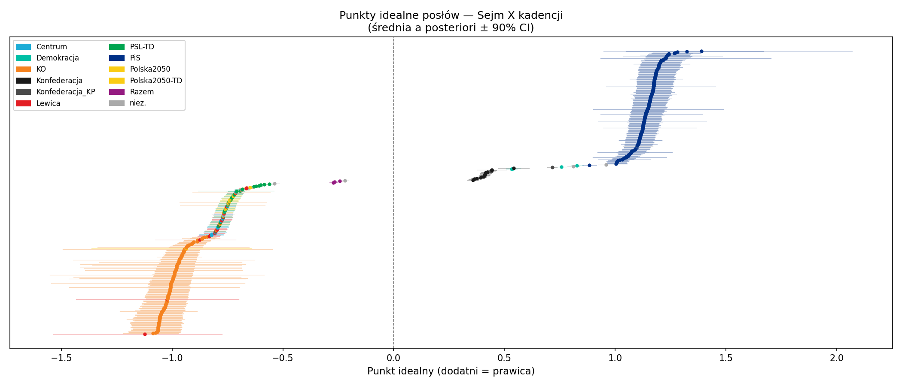
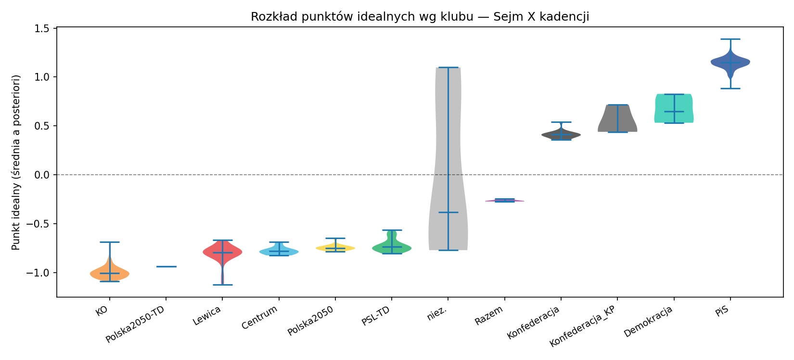

# Mapping a Parliament from Its Votes: A Bayesian Ideal-Point Model of the Polish Sejm

> **Draft scaffold.** Math uses `$…$` / `$$…$$` (renders natively on GitHub,
> Dev.to, Hashnode; on Medium render formulas as images). Figures live in
> `figures/` — export them from `results/` after running the pipeline.
> Language: English (data-science audience). A Polish version is trivial to derive.

*An educational walk through computational statistics — what started as a study of
the Metropolis–Hastings algorithm and ended as a Gibbs sampler with good results
and an unfilled niche.*

---

## 1. The niche

The United States has [Voteview](https://voteview.com): a public, interactive map
of every legislator's position on the main voting axis, estimated from roll-call votes. Most
other democracies have nothing comparable. Poland has excellent **descriptive**
tools (vote trackers, attendance, party discipline) but **no public estimate of
where individual MPs sit on a latent main axis of division** recovered from their votes.

This project fills that gap for the Sejm (10th term) — and doubles as a hands-on
tour of MCMC: the spatial voting model, why the textbook sampler fails here, and
which one actually works.

## 2. The model: spatial voting → item response theory

Each MP $i$ has a latent **ideal point** $x_i \in \mathbb{R}$ (position on the
main axis of conflict). Each vote $j$ pits a "yes" outcome against a "no" outcome,
each located in the same space. An MP's utility for an outcome decreases with the
squared distance from their ideal point, plus a random shock. After expanding the
squared-distance difference, the $x_i^2$ terms cancel and we are left with a
**linear** index, giving the two-parameter item-response (2PL) form:

$$
P(y_{ij} = 1 \mid x_i, \alpha_j, \beta_j) = \Phi(\beta_j x_i - \alpha_j)
$$

- $\beta_j$ — **discrimination**: how sharply vote $j$ sorts the chamber along the axis.
- $\alpha_j$ — **threshold**: the baseline tilt of the vote.
- $\Phi$ — standard normal CDF (probit link).

Assuming conditional independence, the likelihood over observed cells $\mathcal{O}$
of the roll-call matrix is

$$
L(X,\alpha,\beta \mid Y) = \prod_{(i,j)\in\mathcal{O}}
\Phi(\beta_j x_i - \alpha_j)^{y_{ij}}\,\bigl[1-\Phi(\beta_j x_i - \alpha_j)\bigr]^{1-y_{ij}} .
$$

Political scientists call $x_i$ an *ideal point*; psychometricians call the same
object an *ability* in 2PL IRT. They are the same model. (Clinton, Jackman &
Rivers 2004; see `REFERENCES.md`.)

## 3. Priors and identification

Weakly-informative priors:

$$
x_i \sim \mathcal{N}(0,1), \qquad
\alpha_j \sim \mathcal{N}(0,\sigma_\alpha^2), \qquad
\beta_j \sim \mathcal{N}(0,\sigma_\beta^2).
$$

The unit-variance prior on $x$ is doing double duty — it is also an
**identification** device. The linear index $\beta_j x_i - \alpha_j$ has three
symmetries that leave the likelihood unchanged:

1. **Translation** $x_i \mapsto x_i + b$ (absorbed by $\alpha_j$) — fixed by the zero mean.
2. **Scale** $(x_i,\beta_j)\mapsto(cx_i,\beta_j/c)$ — fixed by unit variance.
3. **Reflection** $(x_i,\beta_j)\mapsto(-x_i,-\beta_j)$ — *not* fixed by a symmetric
   prior. We resolve it by **anchoring**: forcing a chosen reference MP (a high-turnout PiS MP) to have $x>0$.

## 4. The posterior, and why we need MCMC

By Bayes' rule the posterior is proportional to likelihood × prior, but the
normalizing constant $Z$ is an integral over thousands of parameters
($n + 2m$ — hundreds of MPs, thousands of votes):

$$
p(X,\alpha,\beta \mid Y) = \frac{L(Y\mid\cdot)\,p(X)p(\alpha)p(\beta)}{Z},
\qquad Z = \int L\,p \; dX\,d\alpha\,d\beta .
$$

$Z$ is intractable. We know the posterior only **up to a constant** — exactly the
setting MCMC is built for.

## 5. The sampler journey

### 5.1 Metropolis–Hastings (the original plan)

MH needs only the *unnormalized* posterior $\tilde\pi(\theta)=L\,p$. Propose
$\theta'$, accept with

$$
a = \min\!\left(1,\ \frac{\tilde\pi(\theta')\,q(\theta\mid\theta')}{\tilde\pi(\theta)\,q(\theta'\mid\theta)}\right).
$$

The intractable $Z$ cancels in the ratio. No gradients — just a ratio of densities.
Beautiful, and the reason MH dominates Bayesian inference. But in *thousands* of
dimensions, random-walk MH mixes terribly.

### 5.2 Reaching for NUTS — and hitting a wall

So I reached for the modern default: the No-U-Turn Sampler (Hamiltonian Monte
Carlo). NUTS is still MCMC with an accept/reject step, but it generates proposals
using the **gradient** of the log-posterior — long, informed moves instead of a
random walk.

It failed badly:

```
R-hat: max = 9.8e15      # want < 1.01
~8.7 s / iteration       # max tree depth, thrashing
```

The culprit is the **multiplicative** term $\beta_j x_i$: it creates a curved,
ridged posterior. With near-perfect party-line votes (balanced 50/50 but perfectly
aligned with the main axis), the likelihood becomes almost a step function and
$\beta_j$ wants to run to infinity. Gradient-based sampling cannot navigate it.

> **Lesson:** "C is faster than Python" and "use a GPU" miss the point. The hot
> loop is already compiled (XLA); NUTS in C++ (Stan) would hit the *same* geometry.
> The problem was the **algorithm**, not the language or the hardware.

### 5.3 Gibbs via Albert–Chib data augmentation (the win)

The fix is exactly what the ideal-point literature uses. Introduce a latent
utility $y^*_{ij} = \beta_j x_i - \alpha_j + \varepsilon_{ij}$,
$\varepsilon\sim\mathcal N(0,1)$, with $y_{ij}=\mathbb 1[y^*_{ij}>0]$. Conditional
on $y^*$, the model is **linear-Gaussian** and every full conditional is closed-form:

- $y^*_{ij}\mid\cdot \sim$ truncated normal,
- $x_i\mid\cdot \sim$ Gaussian (1-D regression of $y^*+\alpha$ on $\beta$),
- $(\beta_j,\alpha_j)\mid\cdot \sim$ bivariate Gaussian (regression of $y^*$ on $(x,-1)$).

Data augmentation **linearizes the link** and sidesteps the curved geometry that
defeated NUTS. Vectorized in NumPy, one sweep is a handful of matrix ops:

```python
# one Gibbs sweep (schematic)
eta   = X @ B.T - alpha[None, :]
ystar = truncated_normal(eta, Y)                 # latent utilities
X     = gaussian_update(ystar, B, alpha)         # ideal points
B, alpha = gaussian_update_votes(ystar, X)       # vote params
standardize(X, B, alpha)                         # parameter expansion (sec 6.2)
```

Synthetic recovery: correlation $\approx 0.99$. ~74 ms/iteration on an M1 CPU.

## 6. Four practical lessons

### 6.1 Separation and the prior

A diffuse hierarchical prior (Half-Cauchy on $\sigma_\beta$) **backfires**: its
heavy tail lets the discrimination scale escape to infinity on perfectly
separating votes. A **fixed, proper** prior ($\sigma_\beta=2$, $\sigma_\alpha=2.5$)
adds prior precision that keeps $\beta$ finite. The conventional diffuse value
$\sigma^2=25$ is *too* loose for a disciplined parliament.

### 6.2 Parameter expansion (scale identification)

With thousands of informative votes, the $\mathcal N(0,1)$ prior is too weak to pin
the scale, which drifts between chains. Standardizing $x$ to mean 0 / SD 1 **each
sweep** — absorbing the scale into $(\beta,\alpha)$ so $\eta$ is unchanged — pins it
hard (Liu–Wu parameter expansion).

### 6.3 Marginal data augmentation is inert here

Could MDA accelerate the (admittedly slow) mixing? **No — and we can show why.**
The single working-scale parameter $g$ is pinned by ~1M observations:

$$
g \approx 1.0036 \pm 0.0007 .
$$

PX-DA's benefit comes from the *variance* of $g$, which here is ~0. The literature's
"10–50× ESS" gains are for probit *regression* (few parameters) or multinomial
probit (a covariance working parameter) — a different regime. The deeper reason:
data augmentation linearizes the *link*, not the bilinear $\beta x$ term, and the
slow mixing comes from the $x\leftrightarrow\beta$ coupling, which no augmentation
fixes. The honest lever is more (parallel) samples.

### 6.4 The data bug that hid in plain sight

Multi-day proceedings repeat in the API's sitting list, and the per-day vote count
*undercounts* the per-proceeding numbering. The naive fetch both **duplicated**
votes (one vote pulled 12×) and **missed** votes (proceeding 1 had 60 votings; only
1–40 were fetched). Symptom that exposed it: 2104 unique vote keys instead of the
expected count. Fix: enumerate each proceeding by probing `votings/{p}/{n}` until a
run of 404s. Result: 3355 → **4164 unique votes** recovered, 0 duplicates.

> **Lesson:** validate data-pipeline assumptions empirically. A plausible-looking
> count can hide both duplication and loss at once.

## 7. Results — one dimension

Final run: 4 chains × 10,000 draws on 499 MPs × 2,570 contested votes.
Convergence: $\hat R_{\max}=1.065$, mean ESS $\approx 608$.

The recovered axis cleanly separates the chamber. Mean position by club:

| Club | mean $x$ |
|---|---|
| KO | −0.99 |
| Lewica | −0.80 |
| Konfederacja | +0.41 |
| PiS | +1.14 |

Face validity, with **no labels given to the model**: at one end of the axis is
Joanna Scheuring-Wielgus (Lewica, −1.12); at the other, PiS MPs Artur Soboń (+1.39)
and Jacek Ozdoba (+1.32). The distribution is strikingly **bimodal** — two blocs with
an almost empty centre, the signature of iron party discipline.

> **Caveat / honesty:** I deliberately do **not** label this axis "left–right" — that
> would impute party ideology the votes alone don't establish. It is best read as the
> **main axis of division**, which in this term most plausibly corresponds to the
> **government–opposition** split (one bloc is the governing coalition, the other the
> opposition). That mapping is term-specific, not an intrinsic ideological scale.




## 8. Results — a second dimension (and a lesson in interpreting it)

Extending to 2-D ideal points (Procrustes alignment + a target rotation that keeps
dim 1 comparable to the 1-D solution) recovers a **modest secondary dimension** that
cross-cuts government–opposition. Convergence (4 chains × 11,000 draws): dim 1
$\hat R_{\max}=1.058$, dim 2 $\hat R_{\max}=1.076$, mean ESS ≈ 650 / 900. Mean dim-2
position by club:

| Club | dim 2 |
|---|---|
| Lewica | −1.31 |
| Razem | −1.29 |
| PiS | −0.29 |
| KO | −0.08 |
| PSL-TD | +0.57 |
| Demokracja | +1.09 |
| Konfederacja | **+4.19** |

**It is tempting to give this dimension a substantive label** from the way the clubs
line up. My first guess was "economic". **It is wrong**, and the way I caught it is the
real lesson here.

A dimension's meaning must come from the **content of the bills that load most
heavily on it**, not from where the parties happen to land plus prior knowledge —
the latter invites confirmation bias. Content-coding the ~12 distinct top-dim-2
bills shows they are **heterogeneous**: asylum/immigration, the Constitutional
Tribunal, armed-forces/border security, the criminal code, local government, plus
personnel votes around Konfederacja's own MPs (dismissing vice-marshal Bosak) — and
only ~2 of 12 fall under an economic topic. The honest description: dim 2 is
**dominated by the votes where Konfederacja (and occasionally other small clubs)
breaks from the KO–PiS pattern**, spanning several unrelated issue areas. I do not
attach an ideological label to it.

> **Lesson:** the model recovers *geometry*; humans supply the *labels* — and the
> labels are only defensible if read off the high-discrimination items, not the party
> map. Here that step demoted a tidy "economic axis" story to an honest "heterogeneous,
> Konfederacja-driven second cleavage".

Whether even this second dimension is worth the trouble is itself testable. A
dimensionality pilot (model-free scree; classification gain; per-dimension
discrimination) says: dim 1 alone classifies 98.6% of votes, dim 2 adds 0.7 pp, and
a **third dimension adds 0.1 pp — noise**. The Sejm is, to a very good approximation,
one-dimensional with a faint second dimension.


## 9. The interactive site & reproducibility

A static site (no backend) presents the estimates: a beeswarm of MPs colored by
club, per-MP profiles (position ± CI, rank, turnout, party loyalty, a chamber
distribution histogram), and per-vote **breakdowns** — for contested
votes the model probability heatmap $\Phi(\beta x-\alpha)$ with the cutting point
$x^*=\alpha/\beta$ (à la Voteview), empirical otherwise.

Everything is reproducible from public data:

```bash
python fetch_data.py        # roll-call from api.sejm.gov.pl
python run.py               # Gibbs sampler -> ideal points
python make_site_data.py    # export site JSON
```

Repo: **[link]** · Data: [api.sejm.gov.pl](https://api.sejm.gov.pl)

## 10. Conclusion

I set out to study Metropolis–Hastings and ended with a Gibbs sampler, because the
geometry of this model rewards data augmentation over gradient-based HMC. Along the
way: a separation-aware prior, parameter expansion for identification, a negative
result on marginal data augmentation, and a data-pipeline bug worth remembering.
The output is the public per-MP ideal-point map that Poland lacked.

---

*References: see [`REFERENCES.md`](../REFERENCES.md).*
*Disclaimer: an "ideal point" is a position in vote space, not a judgment of a
politician. Uncertainty grows for MPs who vote rarely.*
