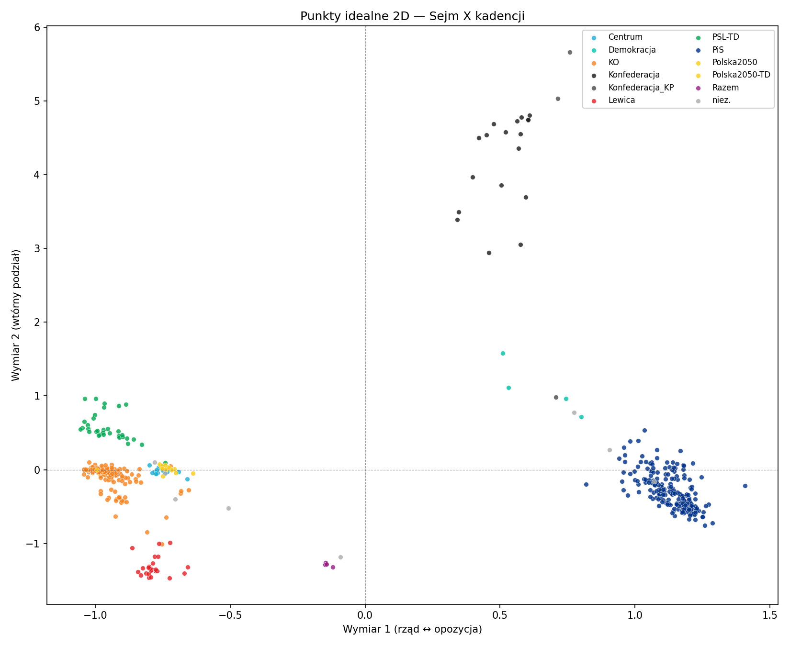

# Mapping a Parliament from Its Votes: A Bayesian Ideal-Point Model of the Polish Sejm

**Part 2 — A Second Dimension (and a Lesson in Interpreting One)**

> **Draft scaffold.** Math uses `$…$` / `$$…$$` (renders natively on GitHub,
> Dev.to, Hashnode; on Medium render formulas as images). Figures live in
> `figures/`. Language: English (data-science audience).
> This is **Part 2 of two**. [`ARTICLE.md`](ARTICLE.md) covers the
> one-dimensional model, its derivation, and the Gibbs sampler — read it first.

*Extending the ideal-point model to two latent dimensions. The hard part is not
sampling — it is **identifying** the extra dimension, and resisting the urge to
name it.*

---

## 1. Why a second dimension at all

Part 1 placed every MP on a single main axis and showed the Sejm is, to a good
approximation, **one-dimensional**: one bloc of votes against another, with an
almost empty centre. But "to a good approximation" is an empirical claim, not an
assumption. Does a **second** axis carry signal — a cleavage that cross-cuts the
main one — or only noise? To answer that we have to actually estimate a 2-D model,
and that raises an identification problem the 1-D model did not have.

## 2. The model in $D$ dimensions

The generalization is immediate. MP $i$ now has an ideal **point**
$\mathbf{x}_i \in \mathbb{R}^D$, and each vote $j$ a discrimination **vector**
$\boldsymbol\beta_j \in \mathbb{R}^D$ with a scalar threshold $\alpha_j$:

$$
P(y_{ij} = 1 \mid \mathbf{x}_i, \boldsymbol\beta_j, \alpha_j)
= \Phi\!\bigl(\boldsymbol\beta_j^{\top}\mathbf{x}_i - \alpha_j\bigr)
= \Phi\!\Bigl(\textstyle\sum_{d=1}^{D}\beta_{jd}\,x_{id} - \alpha_j\Bigr).
$$

The same Albert–Chib data augmentation works unchanged: introduce the latent
utility $y^{\ast}_{ij} = \boldsymbol\beta_j^{\top}\mathbf{x}_i - \alpha_j +
\varepsilon_{ij}$, and conditional on $y^{\ast}$ every full conditional is again
Gaussian / truncated-Gaussian — only now the update for $\mathbf{x}_i$ is a
**$D$-variate** regression, and the update for $(\boldsymbol\beta_j,\alpha_j)$ a
regression on $(\mathbf{x},-1)$. Here $D=2$.

## 3. The identification problem (and its post-hoc fix)

In 1-D we fixed three symmetries — translation, scale, reflection — with a
unit-variance prior plus an anchor (Part 1, §3). In $D>1$ the same likelihood is
invariant under a much larger group: any **rotation** of the latent space can be
undone by counter-rotating the discrimination vectors,

$$
\mathbf{x}_i \mapsto R\,\mathbf{x}_i, \qquad
\boldsymbol\beta_j \mapsto R\,\boldsymbol\beta_j, \qquad
R \in O(D)\;\;(\text{orthogonal: rotations + reflections}),
$$

leaves every $\boldsymbol\beta_j^{\top}\mathbf{x}_i$ — and hence the likelihood —
unchanged. To pin the scale we **whiten** $X$ each sweep (a generalized
parameter expansion: standardize the $D$-dimensional cloud to identity
covariance, absorbing the transform into $\boldsymbol\beta$). Whitening fixes
scale and location, but it leaves the orthogonal group $O(D)$ **free** — each
chain wanders into its own rotated, reflected frame.

This has a sharp practical consequence:

> **R-hat and ESS must be computed on Procrustes-aligned draws.** Computing them
> on the raw draws compares chains living in different rotational frames and
> reports massive, *artificial* non-convergence. Alignment first, diagnostics
> second.

So identification is done **after sampling**, in three steps:

1. **Procrustes alignment.** Pool all draws (every chain, every iteration) and
   rotate/reflect each to best match a common reference cloud (a few iterations of
   alternating Procrustes). This collapses the $O(D)$ freedom to a single frame.
2. **Target rotation.** Rotate that common frame so **dimension 1 lines up with
   the 1-D solution** from Part 1. This keeps the main axis comparable across the
   two analyses; dimension 2 is then whatever orthogonal residual remains.
3. **Sign fixing.** Per axis, fix the reflection by a convention — the anchor MP
   positive on dim 1, the most extreme MP positive on dim 2.

Only after these three steps do the coordinates mean anything stable, and only
then do we report convergence.

## 4. Sampling and convergence

Estimated with 4 chains × 11,000 draws (warm-start continuation, as in Part 1).
On the **aligned** draws:

| Dimension | $\hat R_{\max}$ | mean ESS |
|---|---|---|
| dim 1 | 1.058 | ≈ 650 |
| dim 2 | 1.076 | ≈ 900 |

Both dimensions converge; dim 1 stays consistent with the one-dimensional model,
as the target rotation intends.

## 5. Results — the second dimension

Mean dim-2 position by club:

| Club | dim 2 |
|---|---|
| Lewica | −1.31 |
| Razem | −1.29 |
| PiS | −0.29 |
| KO | −0.08 |
| PSL-TD | +0.57 |
| Demokracja | +1.09 |
| Konfederacja | **+4.19** |

**It is tempting to give this dimension a substantive label** from the way the
clubs line up. My first guess was "economic". **It is wrong**, and the way I
caught it is the real lesson of this part.

## 6. The lesson: geometry is recovered, labels are supplied

A dimension's meaning must come from the **content of the bills that load most
heavily on it** — the high-discrimination items — not from where the parties
happen to land plus prior knowledge. The latter invites confirmation bias: you
already "know" what each party stands for, so any axis they spread along gets the
label you expected.

Content-coding the ~12 distinct top-dim-2 bills shows they are **heterogeneous**:
asylum/immigration, the Constitutional Tribunal, armed-forces/border security, the
criminal code, local government, plus personnel votes around Konfederacja's own
MPs (dismissing vice-marshal Bosak) — and only ~2 of 12 fall under an economic
topic. The honest description: dim 2 is **dominated by the votes where
Konfederacja (and occasionally other small clubs) breaks from the KO–PiS
pattern**, spanning several unrelated issue areas. I attach **no** ideological
label to it.

> **Lesson:** the model recovers *geometry*; humans supply the *labels* — and the
> labels are only defensible if read off the high-discrimination items, not the
> party map. Here that step demoted a tidy "economic axis" story to an honest
> "heterogeneous, Konfederacja-driven second cleavage".

## 7. Is the second dimension even worth it?

Whether this dimension earns its keep is itself testable. A dimensionality pilot
(model-free scree; classification gain; per-dimension discrimination) is decisive:

- dim 1 alone classifies **98.6%** of votes,
- dim 2 adds **+0.7 pp**,
- a **third** dimension adds **+0.1 pp — noise**.

The Sejm is, to a very good approximation, **one-dimensional with a faint second
dimension**. The second axis is real (it converges, and it cross-cuts the main
one), but it is a small correction, carried by a narrow set of votes — not a
co-equal cleavage.

## 8. Conclusion

The two-dimensional model is the same Albert–Chib Gibbs sampler from Part 1 with a
vector-valued discrimination — the estimation is easy. The work is in
**identification**: whitening leaves the latent space free to rotate, so the
diagnostics and the coordinates only become meaningful after Procrustes alignment,
a target rotation onto the 1-D axis, and a sign convention. Once that is done, the
data say the Sejm has one dominant axis and a faint, **issue-heterogeneous** second
one that I decline to name beyond what its highest-discrimination votes support.

The broader takeaway is methodological: a latent-space model hands you a geometry,
not a meaning. Reading meaning off the party map is where analyses go wrong; reading
it off the discriminating items is where they stay honest.

---

*References: see [`REFERENCES.md`](../REFERENCES.md).*
*Disclaimer: an "ideal point" is a position in vote space, not a judgment of a
politician. Uncertainty grows for MPs who vote rarely.*
